# Data-Structure: Bubble-Sort-Algorithm

Bubble sort is a simple sorting algorithm. This sorting algorithm is comparison-based algorithm in which each pair of adjacent elements is compared and the elements are swapped if they are not in order. 

This algorithm is not suitable for large data sets as its average and worst case complexity are of Ο(n2) where n is the number of items.

## How Bubble Sort Works?

We take an unsorted array for our example. Bubble sort takes Ο(n2) time, so we're keeping it short and precise.

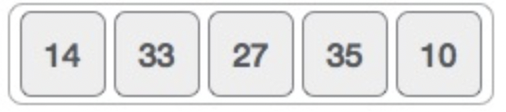

Bubble sort starts with very first two elements, comparing them to check which one is greater.

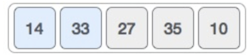

In this case, value 33 is greater than 14, so it is already in sorted locations. Next, we compare 33 with 27.


We find that 27 is smaller than 33 and these two values must be swapped.

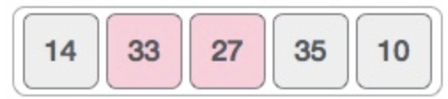

The new array should look like this −

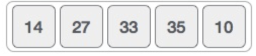

Next we compare 33 and 35. We find that both are in already sorted positions.

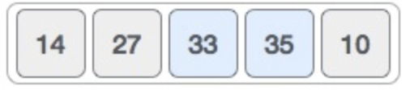

Then we move to the next two values, 35 and 10.

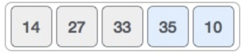

We know then that 10 is smaller 35. Hence they are not sorted.

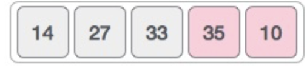

We swap these values. We find that we have reached the end of the array. After one iteration, the array should look like this −

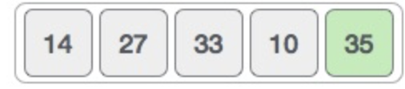

To be precise, we are now showing how an array should look like after each iteration. After the second iteration, it should look like this −

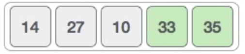

Notice that after each iteration, at least one value moves at the end.

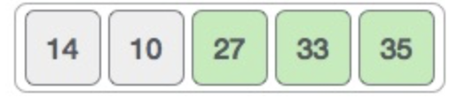

And when there's no swap required, bubble sorts learns that an array is completely sorted.

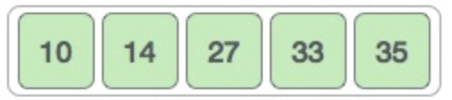

Now we should look into some practical aspects of bubble sort.

## Algorithm

We assume list is an ArrayList of n elements. We further assume that swap function swaps the values of the given array elements.

```java
public void sort(ArrayList<Integer> integers){
    Integer count = 0;
    Integer outerLength = integers.size();
    for (int i=0; i< outerLength-1; i++) {
        Integer innerLength = outerLength;
        for(int x= 0; x < innerLength-1; x++){
            Integer a = integers.get(x);
            Integer b = integers.get(x+1);
            if(a.compareTo(b)> 0){
                integers.set(x, b);
                integers.set(x+1, a);
            }
        }
        count++;
    }
    System.out.println("Took " + count + " times to sort");
}
```


## Implementation

One more issue we did not address in our original algorithm and its improvised pseudocode, is that, after every iteration the highest values settles down at the end of the array. Hence, the next iteration need not include already sorted elements. For this purpose, in our implementation, we restrict the inner loop to avoid already sorted values.

## Full Implementation

In the package `com.codedifferently.sorting.bubble.integerSorter.IntegerBubbleSorter`

Complete these:

* BubbleSorter
* BubbleSorterDriver

### BubbleSorter

```
public class BubbleSorter{

    public void sort(ArrayList<Integer> integers){
        Integer count = 0;
        Integer outerLength = integers.size();
        for (int i=0; i< outerLength-1; i++) {
            Integer innerLength = outerLength-1;
            for(int x= 0; x < innerLength-1; x++){
                Integer a = integers.get(x);
                Integer b = integers.get(x+1);
                if(a.compareTo(b)> 0){
                    integers.set(x, b);
                    integers.set(x+1, a);
                }
            }
            count++;
        }
        System.out.println("Took " + count + " times to sort");
    }


    public String printArray(List<Integer> integers)
    {
        StringBuilder builder = new StringBuilder();
        for (Integer integer:integers)
            builder.append(integer + " ");
        return builder.toString().trim();
    }
}

```

### BubbleSorterDriver

```
public static void main(String args[]){
    BubbleSorter ob = new BubbleSorter();
    ArrayList<Integer> integerList = new ArrayList<Integer>(Arrays.asList(64, 34, 25, 12, 22, 11, 90));
    System.out.println("Before: "+ob.printArray(integerList));
    ob.sort(integerList);
    System.out.println("After: "+ob.printArray(integerList));
}
```

### Create Unit Test Now for the Bubble Sorter

Use the `BubbleSorterDriver` as inspiration for writing unit

### Create a PeopleSorter

Using the bubble sorting pattern complete the `PeopleSorter` class in the package `com.codedifferently.sorting.bubble.peopleSorter`.

DON'T forget your unit test.

