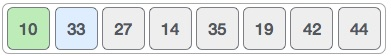
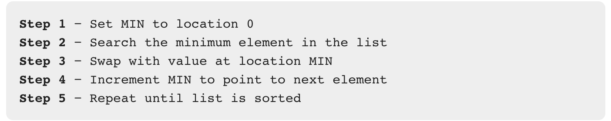
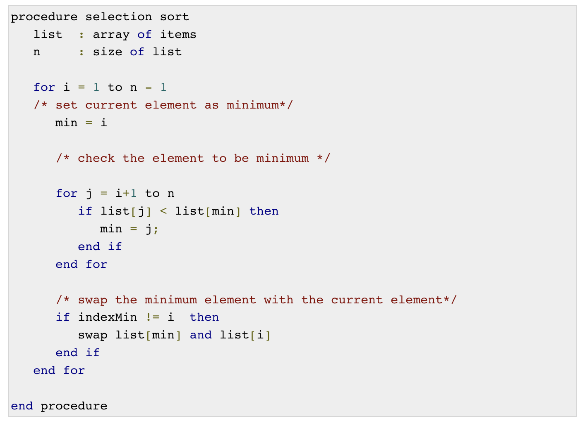

# Data Structure: Selection Sort

Selection sort is a simple sorting algorithm. This sorting algorithm is an in-place comparison-based algorithm in which 
the list is divided into two parts, the sorted part at the left end and the unsorted part at the right end. Initially, 
the sorted part is empty and the unsorted part is the entire list.

The smallest element is selected from the unsorted array and swapped with the leftmost element, and that element becomes
a part of the sorted array. This process continues moving unsorted array boundary by one element to the right.

This algorithm is not suitable for large data sets as its average and worst case complexities are of Ο(n2), 
where n is the number of items.

## How Selection Sort Works?

Consider the following depicted array as an example.


For the first position in the sorted list, the whole list is scanned sequentially. The first position where 14 is stored 
presently, we search the whole list and find that 10 is the lowest value.


So we replace 14 with 10. After one iteration 10, which happens to be the minimum value in the list, appears in the 
first position of the sorted list.


For the second position, where 33 is residing, we start scanning the rest of the list in a linear manner.



We find that 14 is the second lowest value in the list and it should appear at the second place. We swap these values.


After two iterations, two least values are positioned at the beginning in a sorted manner.


The same process is applied to the rest of the items in the array.

Following is a pictorial depiction of the entire sorting process −


Now, let us learn some programming aspects of selection sort.


## Algorithm



## Pseudocode



## Full Implementation

In the package `com.codedifferently.sorting.selection.integerSorter`

Complete these :

* IntegerSelectionSorter
* IntegerSelectionSorterDriver

### IntegerSelectionSorter

```
public class IntegerSelectionSorter {
    public void sort(ArrayList<Integer> integers){
        Integer count = 0;
        Integer outerLength = integers.size();
        for(int i=0; i < outerLength -1; i++){
            Integer minimumIndex = i;
            Integer innerLength = outerLength-1;
            for(int x=0; x < innerLength-1; x++){
                Integer currentValue = integers.get(x);
                Integer valueAtMinimumIndex = integers.get(minimumIndex);
                if(currentValue < valueAtMinimumIndex){
                    minimumIndex = x;
                }
                Integer temp = valueAtMinimumIndex;
                integers.set(minimumIndex, currentValue);
                integers.set(x, temp);

            }
            count++;
        }
        System.out.println("Took " + count + " times to sort");
    }


    public String printArray(List<Integer> integers)
    {
        StringBuilder builder = new StringBuilder();
        for (Integer integer:integers)
            builder.append(integer + " ");
        return builder.toString().trim();
    }


}
```

### ImageSelectionSorterDriver

```
public static void main(String args[])
{
    IntegerSelectionSorter ob = new IntegerSelectionSorter();
    ArrayList<Integer> integerList = new ArrayList<Integer>(Arrays.asList(64, 34, 25, 12, 22, 11, 90));
    System.out.println("Before: "+ob.printArray(integerList));
    ob.sort(integerList);
    System.out.println("After: "+ob.printArray(integerList));
}
```

### Create Unit Test Now for the Selection Sorter

Use the `ImageSelectionSorterDriver ` as inspiration for writing unit

### Create a PeopleSorter

Using the bubble sorting pattern complete the `PeopleSorter` class in the package `com.codedifferently.sorting.bubble.peopleSorter`.

DON'T forget your unit test.